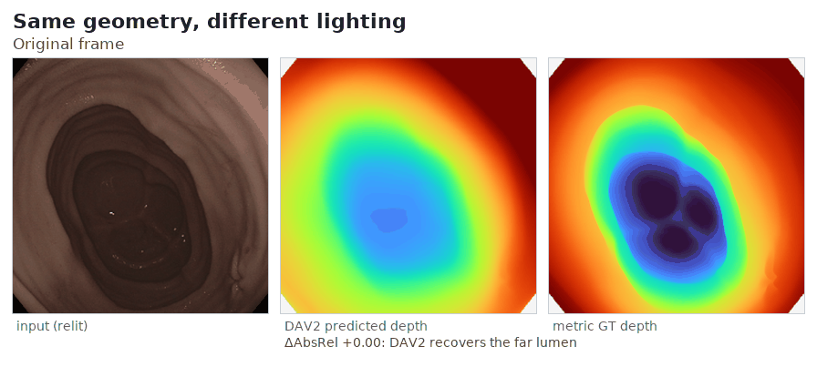

# Bright ≠ Near

**Auditing and Mitigating Illumination Shortcuts in Ground-Truth-Free Endoscopic Depth**

Rayan Albokhari, Chenyu Zhang, Rui Gao, Zexi Li, Jens Rittscher — University of Oxford

AE-CAI | CARE | OR 2.0 | PRiSM workshop at MICCAI 2026, under consideration for the
Special Issue of Wiley IET *Healthcare Technology Letters*.
**Project page:** https://albokhari.github.io/bright-not-near/

> On real endoscopic tissue there is no metric depth ground truth, so monocular depth is
> ranked by correlation metrics against weak references. We show this is unsafe: a
> zero-parameter "bright = near" baseline is not beaten by the best learned models, because
> a co-located camera and light make brightness a near-field depth cue. We audit the
> confound, show with interventional relighting that the reliance is a shortcut rather than
> a valid cue, release a 307-image 4-annotator human-consensus 5-point ordinal benchmark on
> real colonoscopy with a brightness-discordant protocol, and take a preliminary,
> label-dependent step towards mitigation.

<p align="center"></p>

*The interventional probe in one clip: lighting changes that preserve the bright = near
coupling leave DAV2's depth unchanged; breaking the coupling collapses the recovered lumen
while the metric ground truth never moves.*

## Quickstart: score your depth model in three steps

**1. Get the images** (not redistributed here; the benchmark ships labels only).
Download [Kvasir-SEG](https://datasets.simula.no/kvasir-seg/) and note its `images/` path.

**2. Sanity-check your setup** by reproducing the paper's zero-parameter baseline:

```bash
pip install -r requirements.txt          # numpy, Pillow
python evaluate.py --baseline brightness --images /path/to/Kvasir-SEG/images
# expected: pairwise 0.873, ExactMatch 0.365, discordant 0.000
```

**3. Score your model.** Run it on the 307 benchmark images (filenames in
`annotations/consensus_307_points_ranks.json`) and save one prediction map per image,
named by filename stem (`cju...xyz.npy` or `.png`, any resolution):

```bash
python evaluate.py --pred-dir my_preds/ --larger-is farther --bootstrap 10000
```

Use `--larger-is farther` for metric-depth maps; the default assumes disparity
(larger = nearer). **discordant** is the cue-controlled headline metric: it scores only
the 391 pairs where brightness contradicts the consensus order, so it cannot be gamed by
reading the light. For context, on it the brightness baseline scores 0.000, base DAV2
0.711, EndoOmni 0.874, and our relight-consistency fine-tune 0.816 (5-fold).

## Repository map

| Path | Contents |
|---|---|
| `evaluate.py` | Standalone benchmark scorer (the three protocol metrics + bootstrap CIs) |
| `annotations/` | The benchmark: 307 images × 5 points with consensus ranks; per-annotator orders for all 400 candidates (annotators anonymised A1–A4); the 391-pair brightness-discordant split |
| `folds/` | 5-fold and cluster-disjoint fold definitions |
| `code/` | Research code by paper section: cue audit, relighting operators and Exp A, full evaluation protocol, fine-tuning, consensus pipeline (see `code/README.md`) |
| `heads/` | Metadata + loading instructions for the fine-tuned DAV2 depth heads |
| `code/example_loader.py` | Minimal join of annotations ↔ Kvasir-SEG images |

## Trained heads

The ten fine-tuned DPT heads (ordinal fine-tune and relight-consistency, 5 folds each,
~124 MB per head) are attached to the
[v1.0 release](https://github.com/Albokhari/bright-not-near/releases/tag/v1.0):

```bash
wget https://github.com/Albokhari/bright-not-near/releases/download/v1.0/dav2_relightcons_heads.tar.gz
tar xzf dav2_relightcons_heads.tar.gz
```

Load on top of the official [Depth Anything V2](https://github.com/DepthAnything/Depth-Anything-V2)
ViT-L weights (the DINOv2 encoder stays frozen):

```python
from depth_anything_v2.dpt import DepthAnythingV2
model = DepthAnythingV2(encoder="vitl", features=256, out_channels=[256, 512, 1024, 1024])
model.load_state_dict(torch.load("depth_anything_v2_vitl.pth"))
model.depth_head.load_state_dict(torch.load("dav2_relightcons/fold0_head_best.pt"))
```

Training recipes: `code/finetune/`.

## Licence

Code: MIT. Annotations, folds, and trained heads: CC BY 4.0. Kvasir-SEG images are
governed by their own terms (research/education use, no redistribution) and are not
included; all labels are keyed to Kvasir-SEG image identifiers.

## Citation

```bibtex
@article{albokhari2026brightnotnear,
  title   = {Bright $\neq$ Near: Auditing and Mitigating Illumination Shortcuts in
             Ground-Truth-Free Endoscopic Depth},
  author  = {Albokhari, Rayan and Zhang, Chenyu and Gao, Rui and Li, Zexi and Rittscher, Jens},
  journal = {Healthcare Technology Letters},
  year    = {2026},
  note    = {AE-CAI | CARE | OR 2.0 | PRiSM workshop at MICCAI 2026}
}
```
