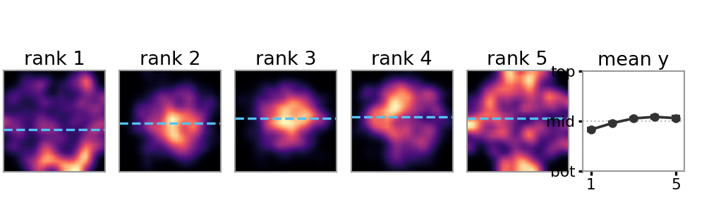

# Annotations

All labels are keyed to **Kvasir-SEG image identifiers** (filenames). The images themselves
are not redistributed; download Kvasir-SEG from its official source and join on `filename`.

## `consensus_307_points_ranks.json`
The benchmark: 307 images, each with five annotated points and their consensus near-to-far
ranks.

```json
{"images": [{"filename": "cju....png", "width": W, "height": H,
             "points": [{"point_id": 1, "x": px, "y": px, "rank": 1..5}, ...5 points]}]}
```
`rank` 1 = nearest, 5 = farthest. Coordinates are pixels in the original image resolution.

## `per_annotator_rankings.json`
All 400 candidate images with every annotator's full 5-point order, the consensus order,
and whether the image reached the >=3/4 exact-order consensus (`"consensus": true` for the
307 retained images, `false` for the 93 non-consensus candidates). Annotators are
anonymised as A1-A4; `owner` is the annotator who placed the points. Orders list point_ids
from nearest to farthest.

## `discordant_pairs.csv`
The brightness-discordant evaluation split: 391 point pairs from 195 images
(`filename, point_id_a, point_id_b`). A pair is discordant when the brighter point
(BT.601 luminance sampled at the annotated pixel) is NOT the point ranked nearer by the
consensus. Derivable deterministically from `consensus_307_points_ranks.json` plus the
Kvasir-SEG images; this file is provided so the split is fixed without reprocessing.

See `../code/example_loader.py` for a worked join of images and annotations.

## Spatial distribution of the points



Spatial density of the annotated points by consensus rank (coordinates normalised to the
frame; dashed line = mean height per rank). Nearer ranks sit lower in the frame on average
(mean normalised height 0.59 for rank 1 vs 0.46-0.47 for ranks 4-5), reflecting how
colonoscopic framing composes the scene, but the distributions overlap heavily: vertical
position is a weak cue (0.577 pairwise accuracy against the consensus) compared with
brightness (0.873).
